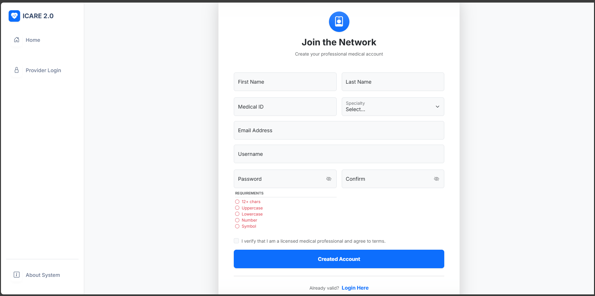
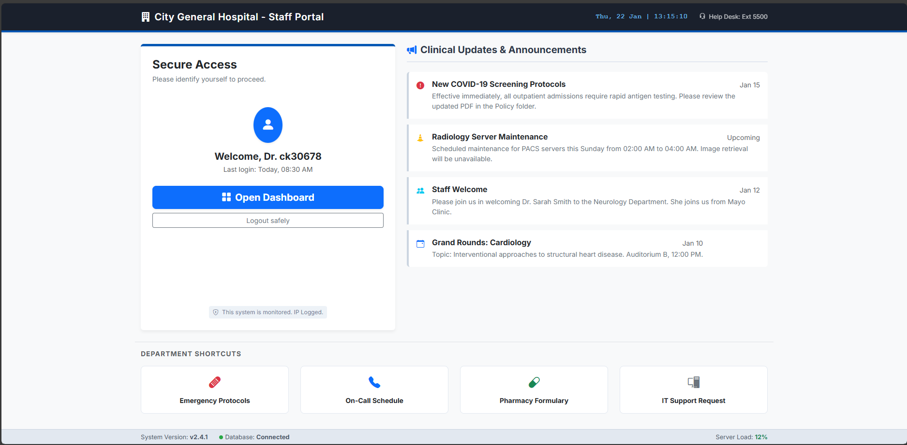
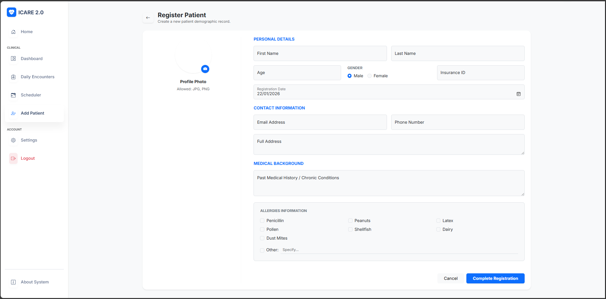
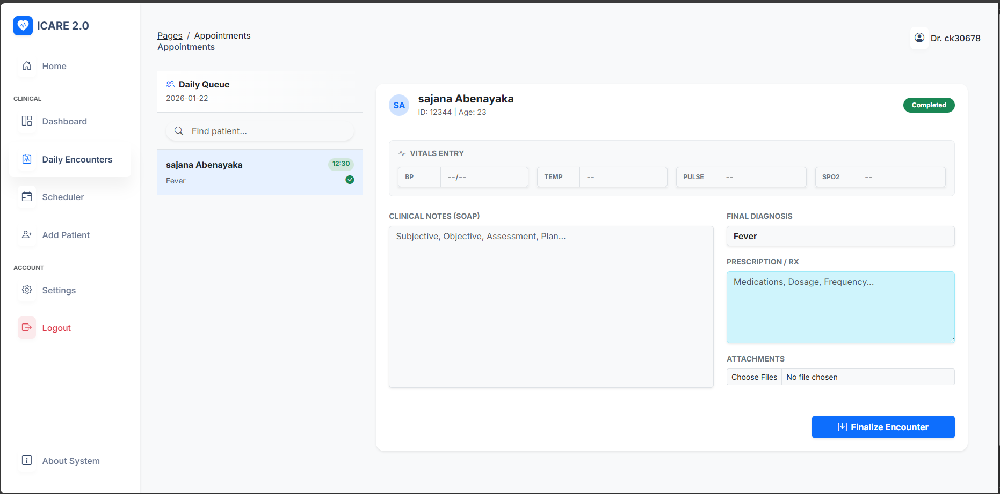

# 🏥 City General Hospital - EHR System


> **A comprehensive, secure, and modern Electronic Health Record (EHR) solution designed to streamline clinical workflows and improve patient data accessibility.**

---

## 📖 Executive Summary
The **City General EHR System** is a robust web-based platform engineered to replace fragmented paper records with a centralized, digital ecosystem. It empowers medical practitioners with a **longitudinal view of patient health**, facilitating better clinical decision-making through real-time vitals tracking, automated metrics, and secure historical data access.

Key differentiators include a **"Split-Pane" Encounter View** for simultaneous history review and documentation, and a role-based security model compliant with modern data standards.

---

## ✨ Key Features

### 🩺 Clinical Operations
* **Split-Pane Encounter Interface:** A unified dashboard allowing doctors to view past Medical History (Left Pane) while documenting current diagnosis and prescriptions (Right Pane).
* **Vitals & Metrics:** Real-time logging of Blood Pressure, Pulse, SpO2, and Temperature.
* **Automated Calculations:** Instant calculation of Age and BMI based on patient demographics and vitals.
* **Allergy Alerts:** Distinct visual indicators for patients with known drug or environmental allergies.

### 🗂️ Patient Management
* **Demographic Profiling:** comprehensive storage of patient details, insurance IDs, and contact info.
* **Medical History Timeline:** A chronological archive of all previous visits, diagnoses, and treatments.
* **Document Management:** Secure upload and retrieval of external reports (PDF, X-Rays).

### ⚙️ Administration & Security
* **Role-Based Access Control (RBAC):** Secure authentication flows for medical staff.
* **Data Integrity:** Foreign key constraints ensure reliable relationships between Doctors, Patients, and Appointments.
* **Audit Readiness:** Timestamped entries for all clinical actions.

---

## 📸 Application Preview

| **Secure Login Portal** | **Physician Dashboard** |
|:---:|:---:|
|  |  |
| *Secure authentication with staff ID verification.* | *Real-time overview of active patients and schedule.* |

| **Patient Profile & History** | **Clinical Encounter & Vitals** |
|:---:|:---:|
|  |  |
| *Detailed demographics and medical background.* | *Split-screen view for efficient documentation.* |

---

## 🛠️ Technical Architecture

* **Backend Framework:** Python Flask (Microframework)
* **Database:** MySQL (Relational Data Persistence)
* **Frontend Interface:** HTML5, CSS3, Bootstrap 5 (Responsive Design)
* **Template Engine:** Jinja2
* **Security:** Bcrypt (Password Hashing), Flask-Session

---

## 🏗️ Database Structure

The system is powered by a relational **MySQL** database with the following architecture:

* **`doctors`**: Stores staff credentials, hashed passwords (Bcrypt), and verification status.
* **`patients`**: Central repository for demographics, **medical history**, **allergy lists**, and insurance data.
* **`appointments`**: The core transactional table linking Patients to Doctors. Contains scheduling info plus clinical encounter data (**Vitals**, **Diagnosis**, **Prescriptions**).
* **`documents`**: Metadata for uploaded files (X-Rays, Lab Reports) linked to specific patients.

---

## 🚀 Installation & Setup Guide

Follow these steps to deploy the application locally.

### 1. Prerequisites
Ensure you have **Python 3.x** and **MySQL Server** installed.

### 2. Clone the Repository
```bash
git clone [https://github.com/sajana1999/EHR_Project.git](https://github.com/sajana1999/EHR_Project.git)
cd EHR_Project

```

### 3. Configure Virtual Environment

```bash
# Windows
python -m venv venv
venv\Scripts\activate

# Mac/Linux
python3 -m venv venv
source venv/bin/activate

```

### 4. Install Dependencies

```bash
pip install -r requirements.txt

```

### 5. Database Initialization

1. Open **MySQL Workbench**.
2. Create a connection to your local server.
3. Open the file `schema.sql` located in this repository.
4. Execute the script to build the `ehr_system` database and tables.

### 6. Configuration

Update `app.py` with your database credentials:

```python
app.config['MYSQL_USER'] = 'your_root_user'
app.config['MYSQL_PASSWORD'] = 'your_password'

```

### 7. Launch Application

```bash
python app.py

```

> Access the portal at: **`http://127.0.0.1:5000`**

---

## 🔮 Future Roadmap

* **Patient Portal:** Allow patients to log in and view their own records.
* **Pharmacy API:** Direct integration with pharmacy systems for e-prescriptions.
* **Telehealth Integration:** Embedded video consultation support.

---

## 👥 Engineering Team

* **Sajana** - *Full Stack Developer* - [GitHub](https://github.com/sajana1999)
* **Ravindu** - *Frontend Architect* - [GitHub](https://github.com/ravindu47)

---

## 📄 License

This project is licensed under the MIT License - see the [LICENSE](https://www.google.com/search?q=LICENSE) file for details.

```

### **Important: Verify Your Image Names**
For the screenshots to appear, ensure the files inside your `Screenshots` folder are named **exactly** as follows (case-sensitive):
* `login.png`
* `dashboard.png`
* `profile.png`
* `encounter.png`

If your files are named differently (e.g., `image_9695f5.png`), rename them to match the names above, or edit the `README.md` code to match your filenames.

```